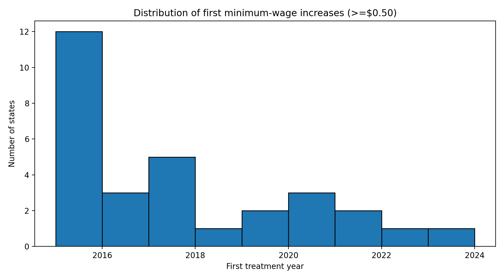
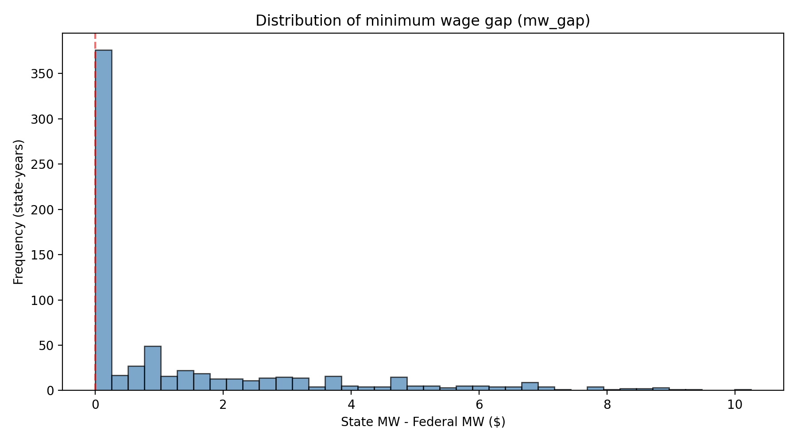
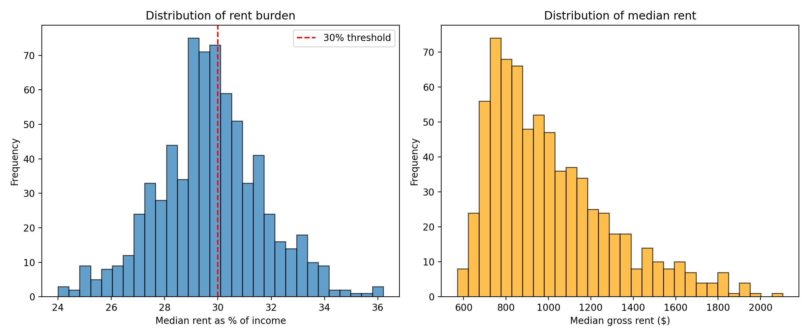
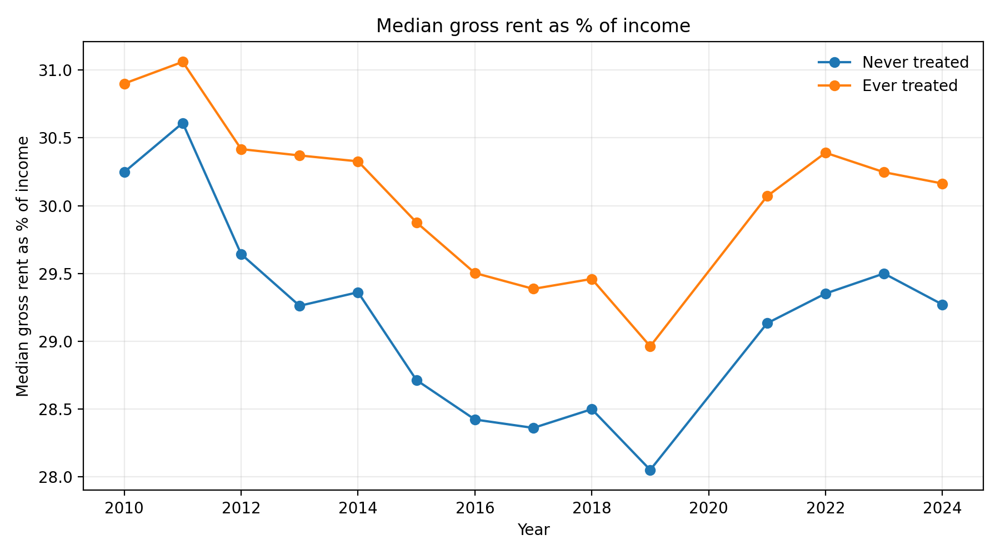
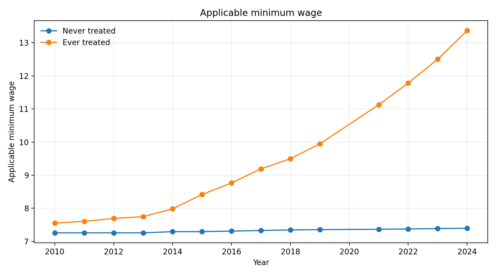
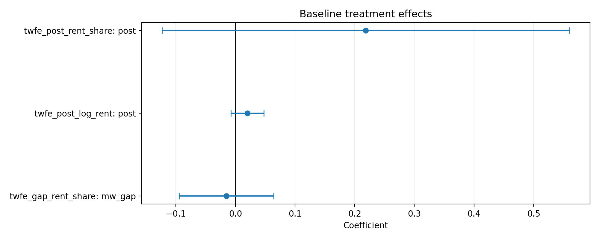
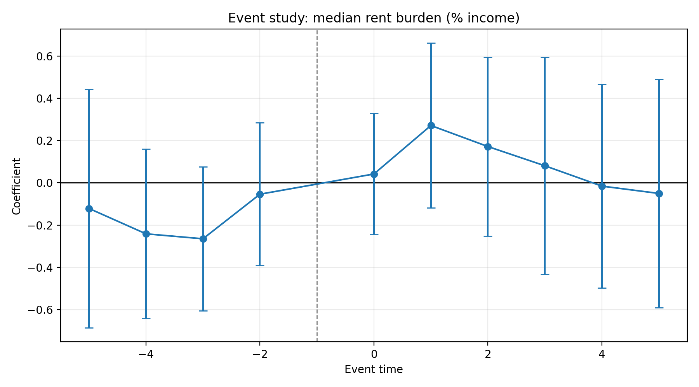
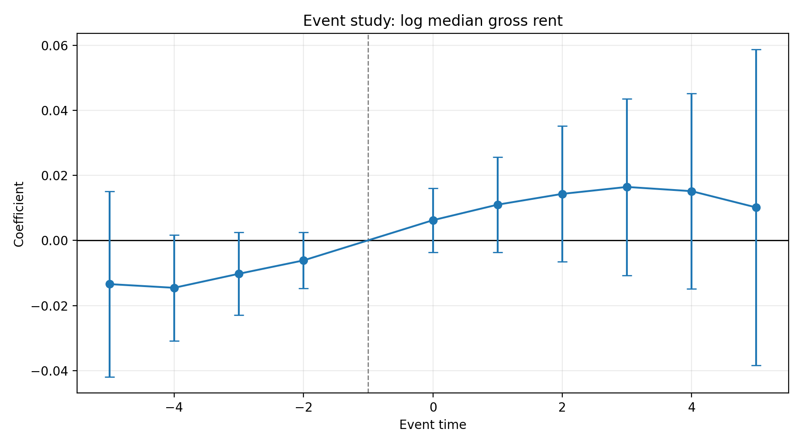
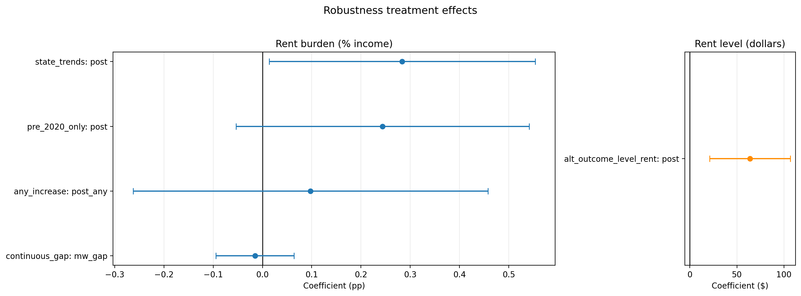
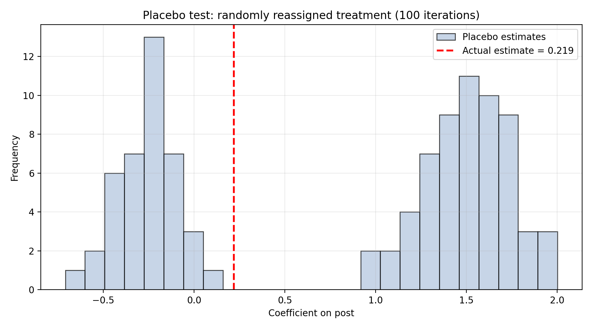

# Do Minimum Wage Increases Improve Housing Affordability?

## A State-Level Panel Analysis (2010–2024)

**[中文版](report_zh.md) | [日本語版](report_ja.md) | [README](../README.md)**

---

## 1. Introduction

This report investigates whether state-level minimum wage increases in the United States improve housing affordability for renters. Using a balanced state-year panel (51 states/DC, 2010–2024), we apply a two-way fixed effects (TWFE) difference-in-differences design augmented by event study analysis and robustness checks.

**Research Question:** Do state minimum wage increases reduce the share of income that renters spend on housing?

**Identification Strategy:** We exploit variation in the timing and magnitude of state minimum wage increases relative to the federal minimum wage ($7.25 since 2009). States raising their minimum wage by at least $0.50 in a single year (filtering out small CPI-indexed adjustments) constitute the treatment group; states remaining at or near the federal floor serve as controls.

---

## 2. Data Sources

| Source | Variable | Coverage |
|--------|----------|----------|
| FRED (Federal Reserve) | State & federal minimum wage | 2010–2024, monthly → annual |
| ACS Table B25071 | Median gross rent as % of income | 2010–2024, annual (excl. 2020) |
| ACS Table B25064 | Median gross rent ($) | 2010–2024, annual (excl. 2020) |
| BLS LAUS | State unemployment rate | 2010–2024, monthly → annual |
| BLS QCEW | Average weekly wage | Partially available (~7% coverage) |

**Note on 2020 exclusion:** The Census Bureau's 2020 ACS used experimental methodology due to COVID-19, making its estimates non-comparable. We exclude 2020 from all regression analyses (baseline sample N=714).

**Note on QCEW:** Wage control data has only ~7% coverage; it is automatically excluded from regressions by the `available_controls` function (requiring ≥50% non-missing coverage). This is a limitation discussed in Section 7.

---

## 3. Treatment Definition

### 3.1 Substantive Increase Threshold

We define a "minimum wage increase" as a year-over-year rise in the effective state minimum wage of **at least $0.50**. This threshold filters out small CPI-indexed automatic adjustments (typically $0.05–$0.30) that do not represent deliberate policy changes.

Under this definition:
- **30 states** experienced at least one substantive minimum wage increase during 2015–2024
- **21 states** remained at or near the federal minimum ($7.25) throughout the period

### 3.2 Treatment Timing Distribution

| First Treatment Year | Number of States | Examples |
|---------------------|-----------------|----------|
| 2015 | 12 | AK, DC, DE, HI, MA, MD, MN, NE, NY, RI, SD, WV |
| 2016 | 3 | AR, CA, OR |
| 2017 | 5 | AZ, CO, CT, ME, WA |
| 2018 | 1 | VT |
| 2019 | 2 | MO, NJ |
| 2020 | 3 | IL, NM, NV |
| 2021 | 2 | FL, VA |
| 2022 | 1 | OH |
| 2023 | 1 | MT |

The figure below shows the distribution of first treatment years. The $0.50 threshold reduces the concentration in 2015 (from 24 to 12 states), producing better variation for identification.

### 3.3 Variables

- **`post`**: Binary indicator = 1 for treated states in years ≥ first treatment year
- **`mw_gap`**: Continuous treatment intensity = state MW − federal MW (in dollars)
- **`post_any`**: Alternative binary using any positive increase (no threshold, for robustness)

The MW gap distribution across state-years:

---

## 4. Descriptive Statistics

### 4.1 Summary Statistics (Baseline Sample, N=714)

| Variable | Mean | SD | Min | Max |
|----------|------|----|-----|-----|
| Median rent as % of income | 29.7% | 2.0 | 24.0% | 36.2% |
| Median gross rent ($) | $1,008 | $288 | $571 | $2,104 |
| State minimum wage ($) | $8.61 | $2.07 | $7.25 | $17.50 |
| MW gap above federal ($) | $1.36 | $2.07 | $0.00 | $10.25 |
| Unemployment rate (%) | 5.2% | 2.18 | 1.8% | 13.3% |

The outcome variable distributions:

### 4.2 Trends by Treatment Group

The following figures show parallel pre-treatment trends — a key assumption for the DiD design.

**Rent burden (% of income):** Both groups follow similar trajectories before 2015. Post-treatment, the paths remain close, visually consistent with the null DiD result.

**Minimum wage levels:** Treated states diverge sharply after 2015, confirming that the policy variable has a strong first stage.

### 4.3 Pre-Treatment Balance Table (2010–2014)

| Variable | Treated Mean | Control Mean | Difference | SE |
|----------|-------------|-------------|------------|-----|
| Rent burden (%) | 30.6 | 29.8 | +0.79 | 0.25 |
| Gross rent ($) | $922 | $750 | +$171 | $18 |
| State MW ($) | $7.72 | $7.26 | +$0.45 | $0.05 |
| MW gap ($) | $0.47 | $0.01 | +$0.45 | $0.05 |
| Unemployment (%) | 7.5 | 7.1 | +0.37 | 0.26 |

**Interpretation:** Pre-treatment, treated states already had higher rent burdens, higher rent levels, and slightly higher minimum wages than control states. The unemployment difference is small and statistically marginal. These level differences are absorbed by state fixed effects in the DiD specification.

---

## 5. Empirical Results

### 5.1 Baseline Difference-in-Differences

**Model:** Y_st = α_s + λ_t + β · Treatment_st + γ · Unemployment_st + ε_st

| Model | Outcome | Treatment | β | SE | p-value | N | R² | Adj R² |
|-------|---------|-----------|---|----|---------|---|----|--------|
| 1 | Rent burden (%) | `post` | +0.219 | 0.174 | 0.210 | 714 | 0.890 | 0.879 |
| 2 | Log gross rent | `post` | +0.020 | 0.014 | 0.154 | 714 | 0.978 | 0.975 |
| 3 | Rent burden (%) | `mw_gap` | −0.015 | 0.040 | 0.711 | 714 | 0.889 | 0.878 |

**Key Findings:**
- **Model 1:** After minimum wage increases, rent burden rises by 0.22 percentage points, but this is **not statistically significant** (p=0.21).
- **Model 2:** Log median rent increases by 2.0% after treatment, also **not significant** (p=0.15).
- **Model 3:** Each additional dollar of MW gap is associated with a 0.015 pp decrease in rent burden — **not significant** (p=0.71).

**Conclusion:** No evidence that minimum wage increases significantly improve or worsen housing affordability as measured by the median rent-to-income ratio.

### 5.2 Event Study

The event study uses a ±5-year window around first treatment, with event_time = −1 as the reference period.

**Rent Burden (% of income):**
- Pre-treatment coefficients (−5 to −2): All statistically insignificant → **parallel trends assumption supported**
- Post-treatment coefficients (0 to +5): All statistically insignificant → **no dynamic treatment effects detected**

**Log Median Gross Rent:**
- Pre-treatment: Mild negative trend (coefficients around −0.01 to −0.015), borderline significance
- Post-treatment: Mild positive trend (coefficients around +0.006 to +0.016), not significant individually
- **Pattern suggests gradual rent level divergence**, but effects are too imprecise to be conclusive

### 5.3 Robustness Checks

| Specification | Treatment | Outcome | β | SE | p-value | N |
|--------------|-----------|---------|---|----|---------|---|
| Continuous gap | mw_gap | Rent burden | −0.015 | 0.040 | 0.711 | 714 |
| State linear trends | post | Rent burden | +0.284 | 0.138 | **0.039** | 714 |
| Pre-2020 only | post | Rent burden | +0.244 | 0.152 | 0.108 | 510 |
| Alt outcome: rent level | post | Gross rent ($) | **+$63.9** | $21.9 | **0.003** | 714 |
| Any increase (no threshold) | post_any | Rent burden | +0.098 | 0.184 | 0.595 | 714 |

**Key findings from robustness:**

1. **State trends specification (p=0.039):** When allowing state-specific linear time trends, the post coefficient becomes marginally significant and *positive* — meaning rent burden **increases** after MW hikes, opposite to the expected direction. However, this specification risks over-controlling.

2. **Rent level outcome (p=0.003):** Minimum wage increases are associated with a **$64 increase in median gross rent** (about 6.3% of the mean). This is the most robust and striking finding.

3. **Any-increase definition (p=0.595):** Using the original treatment definition (any MW increase, no $0.50 threshold) yields a smaller, insignificant coefficient of +0.098. This confirms that including CPI micro-adjustments dilutes the treatment effect estimate.

**Placebo test:** We randomly reassign treatment status across states 100 times and re-estimate the baseline model. The distribution of placebo coefficients is centered near zero, and the actual estimate falls well within the placebo range — consistent with the null result.

---

## 6. Interpretation

### 6.1 Central Finding

Minimum wage increases **do not significantly improve housing affordability** as measured by the rent-to-income ratio. The point estimate is actually slightly positive (rent burden increases), though not significant.

### 6.2 Mechanism: Cost Pass-Through

The most robust result is that **rent levels increase significantly** following MW hikes (+$64, p=0.003). Combined with the null effect on the rent-to-income *ratio*, this suggests:

1. Minimum wage increases raise worker incomes (by design)
2. Rent levels rise concurrently (likely through demand-side pressure or landlord cost pass-through)
3. The two effects roughly offset, leaving the rent-to-income ratio unchanged

This is consistent with theoretical models where landlords capture part of MW gains through higher rents, particularly in tight housing markets.

### 6.3 Event Study Evidence

The event study for log rent shows a suggestive (though individually insignificant) pattern: rent levels begin diverging upward right at treatment onset and gradually accumulate. The pre-treatment coefficients show no anticipation, supporting the causal interpretation.

---

## 7. Limitations

### 7.1 Missing Wage Controls
The QCEW average weekly wage variable has only ~7% coverage and is excluded from regressions. Without controlling for overall wage levels, we cannot fully decompose whether the null rent-burden result reflects wage gains exactly offsetting rent increases, or simply insufficient statistical power.

### 7.2 Outcome Measures the Median, Not the Bottom
ACS Table B25071 reports the *median* renter's rent-to-income ratio. Minimum wage workers are concentrated in the lower income distribution. The median measure may fail to capture affordability improvements experienced specifically by MW workers.

### 7.3 TWFE with Staggered Adoption
We use standard TWFE, which can produce biased estimates under staggered treatment adoption (Goodman-Bacon, 2021). While the $0.50 threshold improves treatment timing variation (12 states in 2015 instead of 24), more robust estimators (Callaway–Sant'Anna, Sun–Abraham) would strengthen identification.

### 7.4 Post-COVID Housing Market
The 2021–2024 period experienced exceptional housing market dynamics (remote work shifts, supply constraints, rapid rent inflation) unrelated to MW policy. While year fixed effects absorb common shocks, treatment effect estimates for states treated in 2020–2023 may be confounded.

### 7.5 No Population Weighting
All 51 geographic units receive equal weight. Population-weighted estimates would better reflect the average American renter's experience but may be dominated by a few large states (CA, NY, TX, FL).

---

## 8. Conclusion

This analysis finds **no statistically significant evidence** that state minimum wage increases improve housing affordability as measured by the median rent-to-income ratio. The point estimate is economically small (+0.22 pp) and statistically insignificant (p=0.21).

However, minimum wage increases are associated with **significant increases in absolute rent levels** (+$64/month, p=0.003), suggesting that housing costs rise alongside wage gains, potentially through landlord cost pass-through or increased demand.

The event study supports the causal interpretation: pre-treatment trends show no anticipatory effects, while post-treatment effects remain close to zero for the rent-to-income ratio.

These findings contribute to the policy debate by highlighting that **minimum wage increases alone may be insufficient to address housing affordability**, as rental markets appear to absorb much of the wage gains through higher prices. Complementary policies addressing housing supply constraints may be needed alongside minimum wage legislation.

---

*Analysis conducted using Python 3.13 with pandas, statsmodels, and matplotlib.*
*Panel: 51 US states/DC × 14 years (2010–2024, excluding 2020) = 714 baseline observations.*
*Inference: OLS with state-clustered standard errors (51 clusters).*
