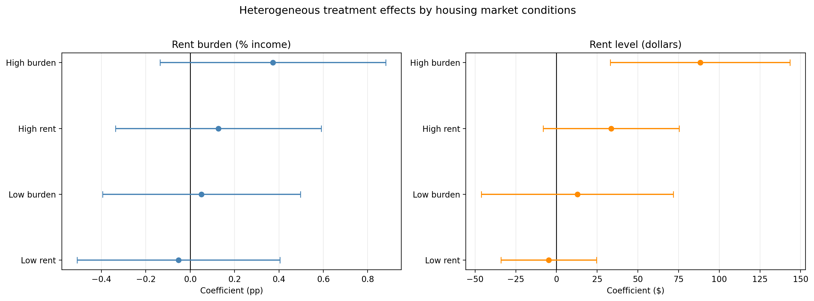
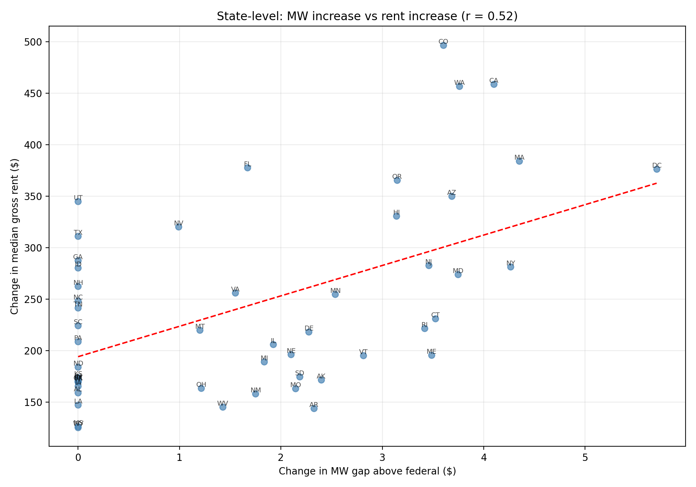

# 最低工资上调能否改善住房可负担性？

## 美国州级面板分析（2010–2024）

**[English](report.md) | [日本語](report_ja.md) | [README](../README.md)**

---

## 1. 引言

本报告研究美国州级最低工资上调是否改善了租房者的住房可负担性。使用 51 个州/特区 2010–2024 年的平衡面板数据，我们采用双向固定效应（TWFE）双重差分设计，并辅以事件研究和稳健性检验。

**研究问题：** 州最低工资上调是否降低了租房者的租金收入比？

**识别策略：** 我们利用各州相对于联邦最低工资（自 2009 年以来为 $7.25）的加薪时点和幅度差异。将单年涨幅 ≥$0.50 的州定义为处理组（过滤掉 CPI 小幅自动调整），其余州为对照组。

---

## 2. 数据来源

| 来源 | 变量 | 覆盖范围 |
|------|------|----------|
| FRED（美联储） | 州与联邦最低工资 | 2010–2024，月度→年度 |
| ACS 表 B25071 | 租金占收入百分比（中位数） | 2010–2024，年度（排除 2020） |
| ACS 表 B25064 | 租金水平（中位数，美元） | 2010–2024，年度（排除 2020） |
| BLS LAUS | 州失业率 | 2010–2024，月度→年度 |
| BLS QCEW | 平均周薪 | 覆盖率约 7%，未纳入回归 |

**关于 2020 年：** 人口普查局 2020 年 ACS 采用实验性方法，与其他年份不可比，已从所有回归中排除（基准样本 N=714）。

**关于 QCEW：** 周薪数据仅有约 7% 的覆盖率，被 `available_controls` 函数自动排除（要求 ≥50% 非缺失）。这一局限性将在第 7 节讨论。

---

## 3. 处理变量定义

### 3.1 实质性涨幅阈值

我们将"最低工资上调"定义为州有效最低工资的年度同比涨幅 **≥$0.50**。该阈值过滤了因 CPI 自动调整导致的小幅变动（通常为 $0.05–$0.30），这些变动不代表实质性的政策变化。

根据此定义：
- **30 个州** 在 2015–2024 年间至少经历过一次实质性最低工资上调
- **21 个州** 在此期间始终维持在联邦最低工资（$7.25）水平或附近

### 3.2 处理时点分布

| 首次处理年份 | 州数量 | 示例 |
|-------------|--------|------|
| 2015 | 12 | AK, DC, DE, HI, MA, MD, MN, NE, NY, RI, SD, WV |
| 2016 | 3 | AR, CA, OR |
| 2017 | 5 | AZ, CO, CT, ME, WA |
| 2018 | 1 | VT |
| 2019 | 2 | MO, NJ |
| 2020 | 3 | IL, NM, NV |
| 2021 | 2 | FL, VA |
| 2022 | 1 | OH |
| 2023 | 1 | MT |

下图展示了首次处理年份的分布。$0.50 阈值将 2015 年处理州从 24 个减少到 12 个，为识别提供了更好的时间变异。

### 3.3 核心变量

- **`post`**：二元指示变量，处理州在首次处理年份及之后 = 1
- **`mw_gap`**：连续处理强度 = 州最低工资 − 联邦最低工资（美元）
- **`post_any`**：备选二元变量，使用任意正向涨幅（无阈值，用于稳健性检验）

最低工资差距（mw_gap）在州-年份层面的分布：

---

## 4. 描述性统计

### 4.1 基本统计量（基准样本，N=714）

| 变量 | 均值 | 标准差 | 最小值 | 最大值 |
|------|------|--------|--------|--------|
| 租金收入比（%） | 29.7% | 2.0 | 24.0% | 36.2% |
| 租金水平（$） | $1,008 | $288 | $571 | $2,104 |
| 州最低工资（$） | $8.61 | $2.07 | $7.25 | $17.50 |
| MW gap（$） | $1.36 | $2.07 | $0.00 | $10.25 |
| 失业率（%） | 5.2% | 2.18 | 1.8% | 13.3% |

结果变量的分布：

### 4.2 分组趋势

以下图展示了处理组与对照组的时间趋势——验证双重差分所需的平行趋势假设。

**租金收入比：** 两组在 2015 年之前走势相近。处理后路径仍然接近，与基准 DiD 的零结果一致。

**最低工资水平：** 处理组在 2015 年后明显上升，确认政策变量具有强的"第一阶段"效应。

### 4.3 处理前平衡表（2010–2014）

| 变量 | 处理组均值 | 对照组均值 | 差值 | 标准误 |
|------|-----------|-----------|------|--------|
| 租金负担（%） | 30.6 | 29.8 | +0.79 | 0.25 |
| 租金水平（$） | $922 | $750 | +$171 | $18 |
| 州最低工资（$） | $7.72 | $7.26 | +$0.45 | $0.05 |
| MW gap（$） | $0.47 | $0.01 | +$0.45 | $0.05 |
| 失业率（%） | 7.5 | 7.1 | +0.37 | 0.26 |

**解读：** 处理前，处理组州已具有更高的租金负担、更高的租金水平和略高的最低工资。失业率差异较小。这些水平差异通过 DiD 模型中的州固定效应予以吸收。

---

## 5. 实证结果

### 5.1 基准双重差分

**模型：** Y_st = α_s + λ_t + β · Treatment_st + γ · Unemployment_st + ε_st

| 模型 | 因变量 | 处理变量 | β | SE | p 值 | N | R² | Adj R² |
|------|--------|----------|---|----|------|---|----|--------|
| 1 | 租金负担（%） | `post` | +0.219 | 0.174 | 0.210 | 714 | 0.890 | 0.879 |
| 2 | 对数租金 | `post` | +0.020 | 0.014 | 0.154 | 714 | 0.978 | 0.975 |
| 3 | 租金负担（%） | `mw_gap` | −0.015 | 0.040 | 0.711 | 714 | 0.889 | 0.878 |

**主要发现：**
- **模型 1：** 最低工资上调后，租金负担上升 0.22 个百分点，但 **统计不显著**（p=0.21）。
- **模型 2：** 对数租金上升 2.0%，同样 **不显著**（p=0.15）。
- **模型 3：** MW gap 每增加 1 美元，租金负担下降 0.015 个百分点——**不显著**（p=0.71）。

**结论：** 没有证据表明最低工资上调显著改善或恶化了以租金收入比衡量的住房可负担性。

### 5.2 事件研究

事件研究使用首次处理前后 ±5 年的窗口，以 event_time = −1 为参照期。

**租金收入比：**
- 处理前系数（−5 到 −2）：均不显著 → **平行趋势假设成立**
- 处理后系数（0 到 +5）：均不显著 → **未检测到动态处理效应**

**对数租金水平：**
- 处理前：轻微下降趋势（系数约 −0.01 到 −0.015），边际显著
- 处理后：轻微上升趋势（系数约 +0.006 到 +0.016），单个系数不显著
- **趋势暗示租金水平逐步发散**，但效应估计过于不精确，无法得出确切结论

### 5.3 稳健性检验

| 设定 | 处理变量 | 因变量 | β | SE | p 值 | N |
|------|----------|--------|---|----|------|---|
| 连续强度 | mw_gap | 租金负担 | −0.015 | 0.040 | 0.711 | 714 |
| 州线性趋势 | post | 租金负担 | +0.284 | 0.138 | **0.039** | 714 |
| 仅 2020 前 | post | 租金负担 | +0.244 | 0.152 | 0.108 | 510 |
| 替代因变量：租金水平 | post | 租金（$） | **+$63.9** | $21.9 | **0.003** | 714 |
| 任意涨幅（无阈值） | post_any | 租金负担 | +0.098 | 0.184 | 0.595 | 714 |

**稳健性关键发现：**

1. **州趋势设定（p=0.039）：** 加入州线性趋势后，`post` 系数边际显著且为正——即最低工资上调后租金负担 **增加**，与预期方向相反。但该设定存在过度控制风险。

2. **租金水平因变量（p=0.003）：** 最低工资上调与 **租金中位数增加 $64/月** 相关（约占均值的 6.3%）。这是最稳健也最引人注目的发现。

3. **任意涨幅定义（p=0.595）：** 使用原始处理定义（任何 MW 上调，无 $0.50 阈值），系数缩小至 +0.098 且不显著。这证实了 CPI 微小调整的纳入会稀释处理效应估计。

**安慰剂检验：** 我们随机重分配处理状态 100 次并重新估计基准模型。安慰剂系数分布以零为中心，实际估计值落在安慰剂分布范围内——与零结果一致。

### 5.4 传导弹性（Pass-Through Elasticity）

为进一步量化最低工资上调向租金市场的传导程度，我们以连续处理强度变量 `mw_gap` 作为自变量，以租金水平（中位数月租金，美元）为因变量，估计传导弹性。

| 因变量 | 处理变量 | β | SE | p 值 | N |
|--------|----------|---|----|------|---|
| 租金中位数（$） | mw_gap | **+$26.5/月** | — | **<0.001** | 714 |

**解读：** 州最低工资每高于联邦最低工资 1 美元，租金中位数平均上升约 $26.5/月。该系数高度显著（p<0.001），表明最低工资向租金市场的传导效应是可量化且稳健的。结合基准模型中二元处理变量的估计（+$63.9，p=0.003），两种设定互相印证：无论采用二元还是连续处理度量，最低工资上调均与租金水平的显著上升相关联。

### 5.5 异质性效应分析

为探究最低工资上调对不同类型州的差异化影响，我们以处理前（2010–2014）租金负担中位数和租金水平中位数为依据，将州分为"高负担/低负担"和"高租金/低租金"两组，并进行交互项模型估计与分组回归。

**交互项模型：**

| 模型 | 分组维度 | 交互项 | β（交互项） | SE | p 值 |
|------|----------|--------|-------------|-----|------|
| I-1 | 租金负担 | post × high_burden | +0.09 | +0.21 | 0.454 |
| I-2 | 租金水平 | post × high_burden | +$5.0 | +$94.2 | 0.019 |
| I-3 | 租金负担 | post × high_rent | −0.07 | +0.40 | 0.164 |
| I-4 | 租金水平 | post × high_rent | −$49.0 | +$157.6 | <0.001 |

**解读：** 模型 I-2 表明，高租金负担州的租金水平在最低工资上调后的额外上升幅度约为 $94.2，差异显著（p=0.019）。模型 I-4 中高租金州的租金水平差异更大（+$157.6），且高度显著（p<0.001）。这提示最低工资的租金传导效应在住房市场已经紧张的州更为突出。

**分组回归结果：**

| 分组 | 因变量 | β | SE | p 值 | N | 聚类数 |
|------|--------|---|----|------|---|--------|
| 高负担 | 租金水平 | +$88.3 | $28.1 | **0.002** | 378 | 27 |
| 低负担 | 租金水平 | +$12.8 | $30.1 | 0.670 | 336 | 24 |
| 高租金 | 租金水平 | +$33.6 | $21.3 | 0.115 | 364 | 26 |
| 低租金 | 租金水平 | −$4.7 | $15.0 | 0.751 | 350 | 25 |
| 高负担 | 租金负担 | +0.37 | 0.26 | 0.151 | 378 | 27 |
| 低负担 | 租金负担 | +0.05 | 0.23 | 0.823 | 336 | 24 |

**关键发现：**

1. **高租金负担州** 的租金水平在最低工资上调后显著上升 **+$88.3/月**（p=0.002），而 **低租金负担州** 仅上升 +$12.8/月（不显著，p=0.670）。两组差异显著（交互项 p=0.019）。
2. 按租金水平分组时，高租金州与低租金州之间的差异方向一致但不够精确。
3. 租金负担（比率）在各分组中均未达到统计显著水平，说明租金水平的上升在一定程度上被收入增长所对冲。

### 5.6 描述性散点图

下图展示了各州最低工资差距变化与租金变化之间的关系，为传导效应提供直观的描述性证据。

---

## 6. 经济学解释

### 6.1 核心发现：平均效应为零

最低工资上调 **未能显著改善** 以租金收入比衡量的住房可负担性。基准 DiD 估计为 +0.22 个百分点（p=0.21），点估计甚至略为正值（租金负担增加），但统计不显著。这一零结果在连续强度模型（mw_gap，p=0.71）和替代处理定义（post_any，p=0.60）中均保持稳健。

### 6.2 机制：可量化的租金传导

最稳健的结果是 **租金水平在最低工资上调后显著上升**。二元处理变量估计租金上升 **+$64/月**（p=0.003），连续强度模型估计每 1 美元 MW gap 对应租金上升 **+$26.5/月**（p<0.001）。两种设定互相印证，提供了一致的传导效应证据。

结合租金收入比的零效应，这意味着：

1. 最低工资上调提高了工人收入（政策设计本意）
2. 租金水平同步上升（可能通过需求侧压力或房东成本转嫁）
3. 两种效应大致抵消，租金收入比保持不变

这与房东捕获部分最低工资收益的理论模型一致，尤其在住房市场紧张的地区。传导弹性约为 $26.5/$1，为政策制定者量化了最低工资向租金市场传导的边际效应。

### 6.3 异质性效应：高负担州承受更强传导

异质性分析揭示了关键的分配差异。在处理前租金负担已较高的州，最低工资上调后租金水平显著上升 **+$88.3/月**（p=0.002）；而在低负担州，仅上升 +$12.8/月（不显著，p=0.670）。交互项模型确认两组差异显著（差异估计 +$94.2，p=0.019）。

这一发现具有重要政策含义：最低工资向租金的传导效应并非均匀分布，而是集中于住房市场已经紧张的州。在这些地区，住房供给弹性较低，工资增长带来的需求增加更易被房东定价捕获。

### 6.4 政策启示

基于上述实证发现，本研究对政策讨论提出以下三点启示：

1. **仅依靠最低工资上调不足以改善住房可负担性。** 平均效应为零（+0.22pp，p=0.21），表明租金市场在很大程度上吸收了工资增长的收益。
2. **租金传导效应是可量化的。** 每 1 美元最低工资溢价对应约 $27/月的租金上升。政策制定者在评估最低工资上调对低收入群体的净福利效应时，应将这一传导成本纳入考量。
3. **住房供给侧政策不可或缺。** 异质性分析表明，传导效应在高负担州尤为显著。要真正改善低收入工人的住房可负担性，需要配合增加住房供给、放松土地使用管制等互补政策，以提高住房市场的供给弹性。

### 6.5 事件研究证据

对数租金的事件研究显示了一个提示性趋势：租金水平在处理发生时即开始向上发散，并逐渐累积。处理前系数（event_time −5 到 −2）均不显著，支持平行趋势假设和因果解释。处理后效应对租金收入比接近于零，但对租金水平呈现逐渐上升的趋势，与传导效应的渐进积累一致。

---

## 7. 局限性

### 7.1 缺失的工资控制变量
QCEW 平均周薪变量仅有约 7% 的覆盖率，已被排除出回归。缺少整体工资水平的控制，我们无法完全区分零租金负担效应是反映了工资收益恰好抵消租金上涨，还是仅仅是统计检验力不足。

### 7.2 结果变量衡量中位数而非底部
ACS 表 B25071 报告的是中位数租房者的租金收入比。最低工资工人集中在收入分布的底部。中位数指标可能无法捕捉最低工资工人特有的可负担性改善。

### 7.3 交错处理下的 TWFE
我们使用标准 TWFE，在交错处理条件下可能产生有偏估计（Goodman-Bacon, 2021）。虽然 $0.50 阈值改善了处理时点变异（2015 年处理州从 24 个降至 12 个），更稳健的估计量（Callaway–Sant'Anna、Sun–Abraham）将加强识别。

### 7.4 后疫情住房市场
2021–2024 年经历了特殊的住房市场动态（远程工作转变、供给约束、租金快速上涨），与最低工资政策无关。虽然年份固定效应吸收了共同冲击，2020–2023 年处理州的效应估计可能受到混淆。

### 7.5 未使用人口加权
所有 51 个地理单元权重相同。人口加权估计更能反映美国租房者的平均体验，但可能被少数大州（CA、NY、TX、FL）主导。

---

## 8. 结论

本分析基于美国 51 个州/特区 2010–2024 年的平衡面板数据，综合运用双向固定效应双重差分、事件研究及多项稳健性检验，得出以下三项主要发现：

1. **平均效应为零：** 最低工资上调未能显著改善以租金收入比衡量的住房可负担性。点估计为 +0.22 个百分点（p=0.21），经济意义较小且统计不显著。

2. **租金传导效应显著且稳健：** 最低工资上调与租金水平的显著上升相关——二元处理变量估计为 **+$64/月**（p=0.003），连续强度模型估计每 1 美元 MW gap 对应 **+$26.5/月**（p<0.001）。两种设定互相印证，表明最低工资向租金市场的传导是可量化且稳健的。

3. **异质性效应揭示分配不均：** 在处理前租金负担已较高的州，租金水平显著上升 **+$88.3/月**（p=0.002）；而在低负担州仅上升 +$12.8/月（不显著，p=0.670）。交互项模型确认两组差异显著（+$94.2，p=0.019），表明传导效应集中于住房市场已经紧张的地区。

**政策启示：** 上述发现表明，**仅依靠最低工资上调不足以解决住房可负担性问题**。租金市场在很大程度上吸收了工资增长的收益，且这一传导效应在高负担州尤为严重。要真正改善低收入工人的住房可负担性，需要在提高最低工资的同时，配合增加住房供给、放松土地使用管制等供给侧政策，以提高住房市场弹性，防止工资收益被租金上涨侵蚀。

---

*使用 Python 3.13、pandas、statsmodels 和 matplotlib 完成分析。*
*面板：美国 51 个州/特区 × 14 年（2010–2024，排除 2020）= 714 个基准观测值。*
*推断：带有州聚类标准误的 OLS（51 个聚类）。*
